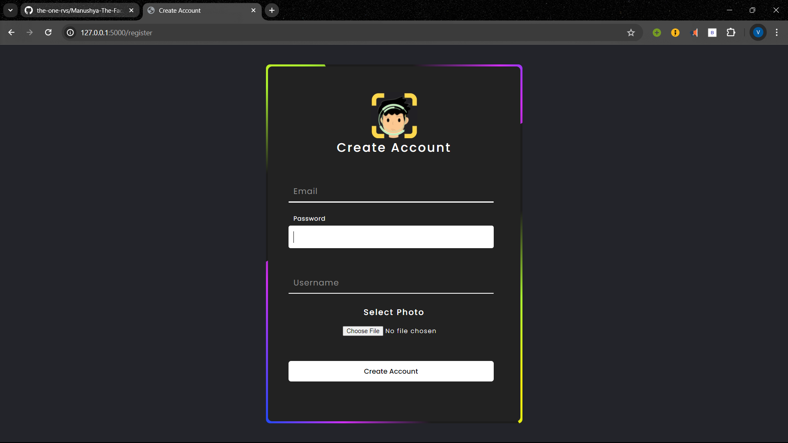
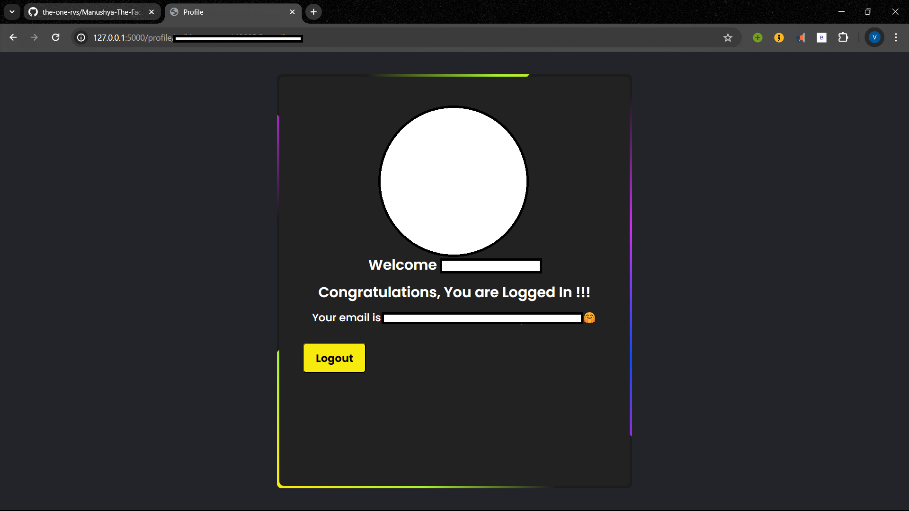

# Manushya: The Face Authenticator

Manushya is a face authentication system built using Flask, OpenCV, Firebase, and face recognition techniques. It allows users to register their face along with their credentials and subsequently log in using facial recognition.

## Features

- **Registration**: Users can register by providing their email, password, username, and a facial image.
- **Authentication**: Registered users can log in using facial recognition.
- **Profile Viewing**: Upon successful authentication, users can view their profile.


## Screenshots






## Setup

1. Clone the repository:

    ```bash
    git clone https://github.com/your-username/Manushya.git
    cd Manushya
    ```

2. Install dependencies:

    Ensure that you are having Visual Studio in C++ installed on your system.

    ```bash
    pip install cmake
    pip install dlib
    pip install opencv-python
    pip install face-recognition
    ```
    These are the major libaries which are needed to run it and if some of them are remaning then kindly look at app.py

3. Obtain Firebase Service Account Key:
    - Generate a service account key JSON file from Firebase console.
    - Save the JSON file as `serviceAccountKey.json` in the project root directory.

4. Configure Firebase:
    - Update the Firebase configuration in the `app.py` file.

5. Run the application:

    ```bash
    python app.py
    ```

6. Access the application in your web browser at `http://localhost:5000`.

## Usage

1. **Registration**:
    - Navigate to `/register` route.
    - Provide email, password, username, and upload a facial image.
    - Click submit to register.

2. **Login**:
    - Navigate to `/login` route.
    - The system will automatically detect and authenticate the user using facial recognition.

3. **Profile Viewing**:
    - Upon successful login, navigate to `/profile/<user_id>` route to view the profile.

## Dependencies

- Flask
- Pyrebase
- OpenCV
- face_recognition
- Firebase Admin SDK

## Contributing

Contributions are welcome! Please feel free to open issues or pull requests.

## License

This project is licensed under the MIT License - see the [LICENSE](LICENSE) file for details.
